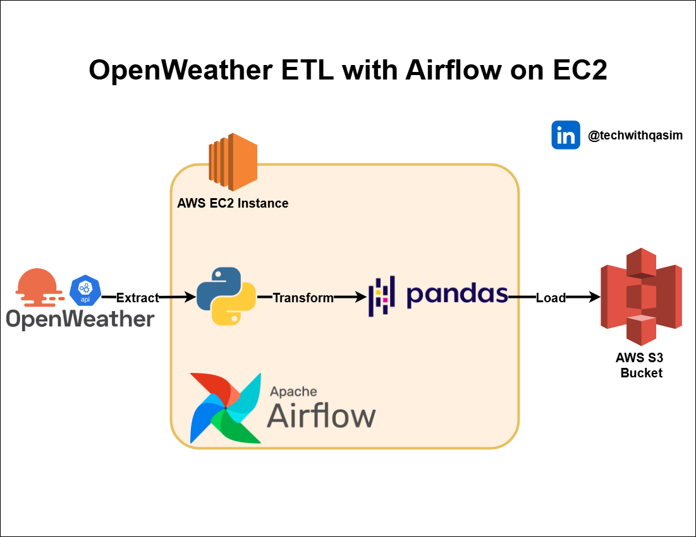

# OpenWeather Data ETL Pipeline with Apache Airflow on AWS EC2

This project demonstrates an ETL pipeline that extracts real-time weather data from the OpenWeather API, transforms it using Python and Pandas, and loads the processed data into an AWS S3 bucket. Apache Airflow orchestrates the entire workflow on an AWS EC2 instance, ensuring automated and scalable data collection.

**Key Features:**
- Extract – Collect weather data from OpenWeather API.
- Transform – Convert temperature to Fahrenheit and format data into CSV.
- Load – Store transformed data in AWS S3 for future analysis.
- Automated Orchestration – DAG scheduling with Apache Airflow.

**Tech Stack:** Apache Airflow | Python | Pandas | AWS EC2 | AWS S3 | OpenWeather API

Perfect for building automated data pipelines and learning ETL orchestration with Airflow!